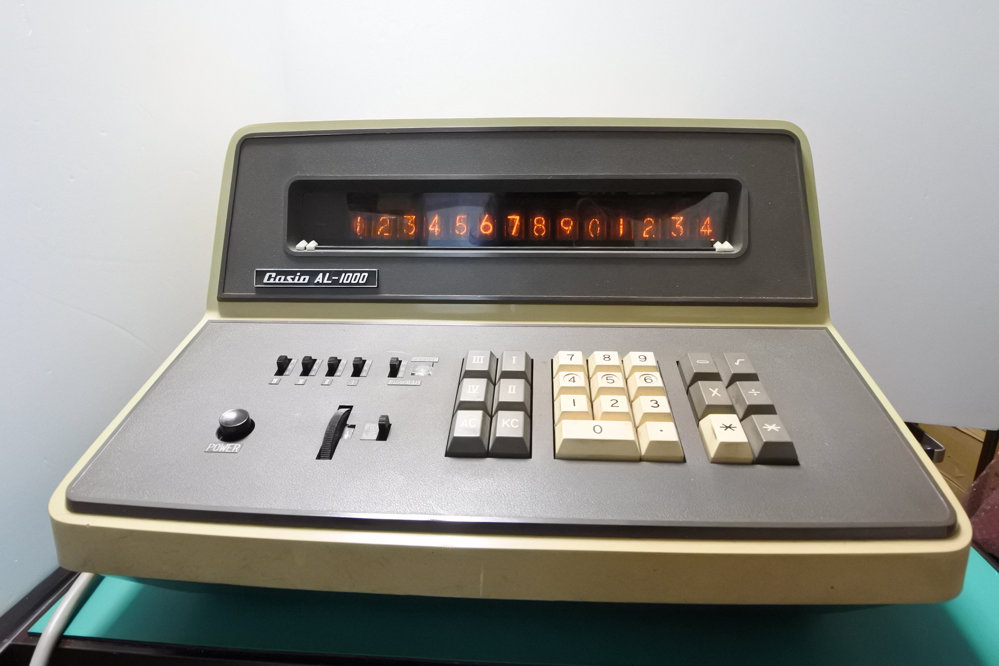
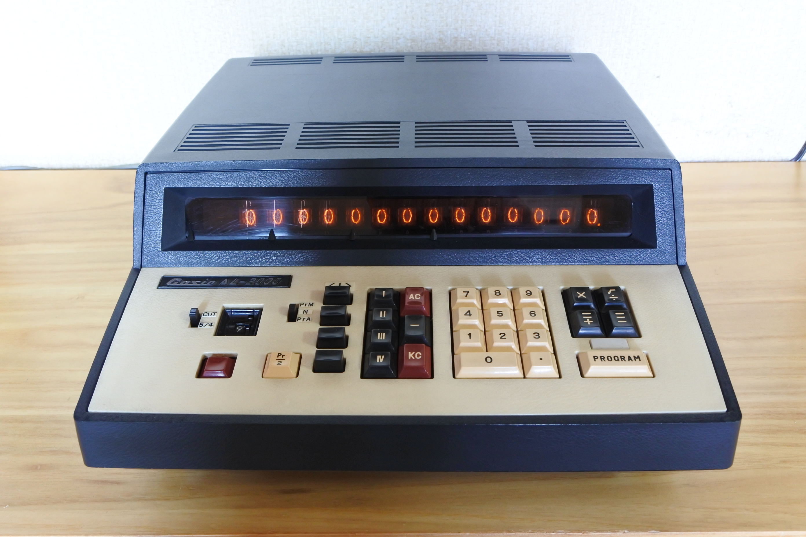
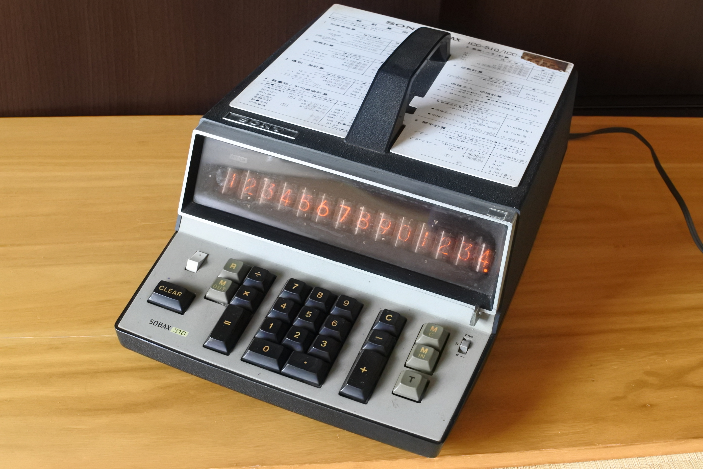
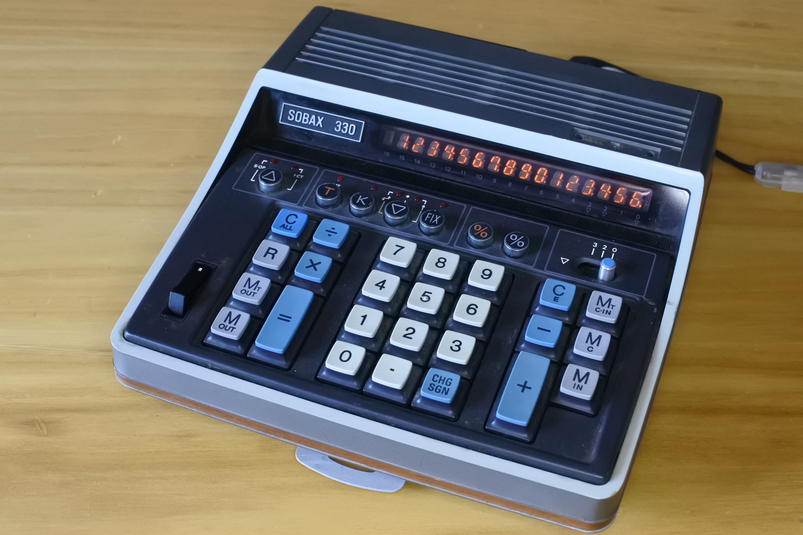
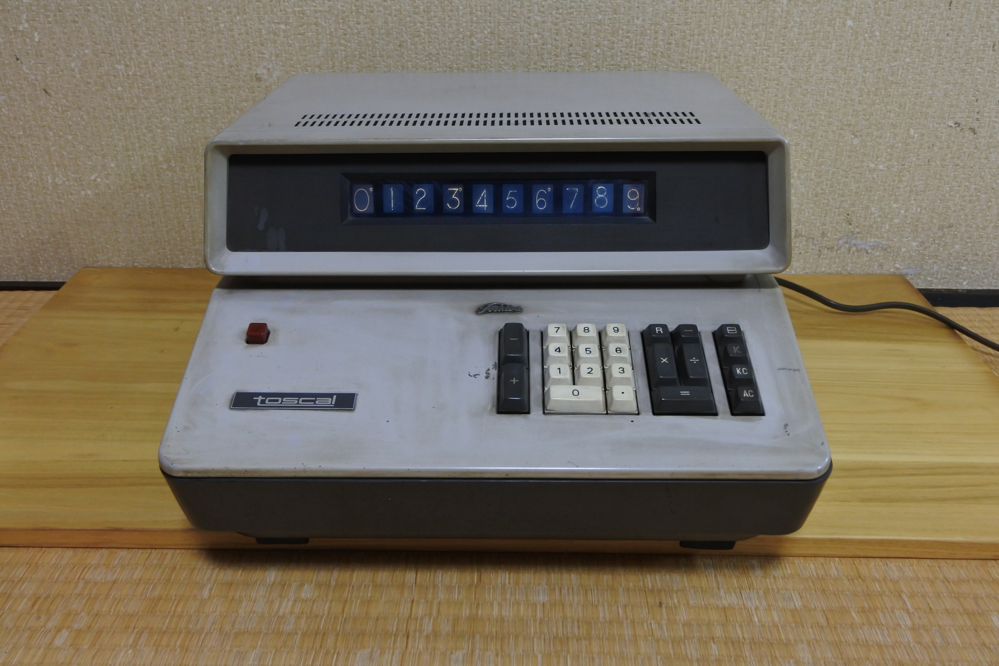
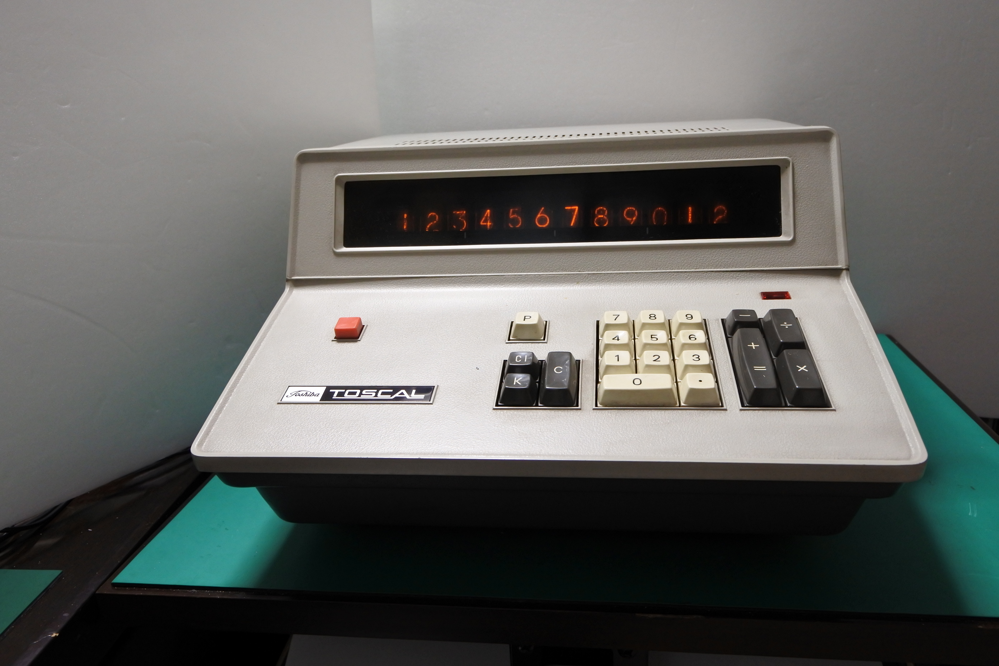
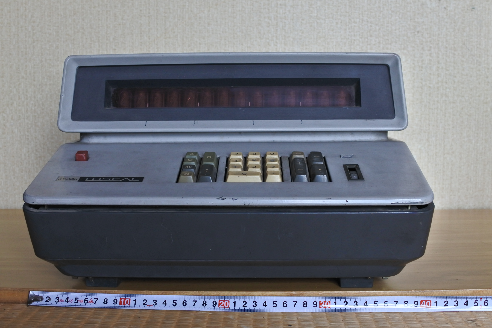
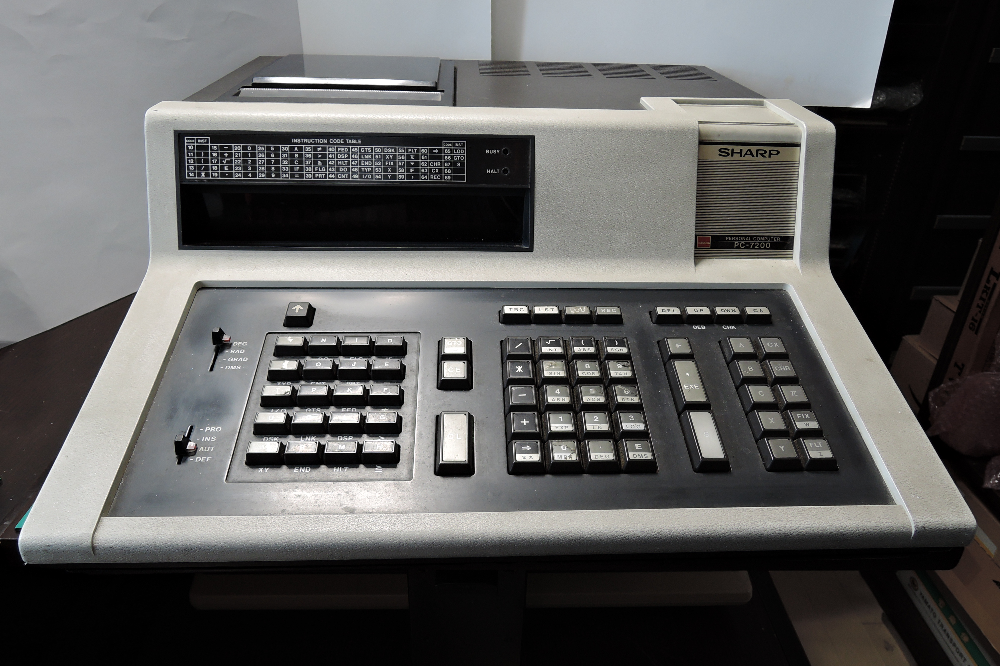

# donation-item-list

過去に収集したいろいろな物品のいくつかを[科学技術継承財団](https://scitech.or.jp/)(夢の図書館+マイコン博物館+模型とラジオの博物館)に寄贈させていただきました。
それらに関する情報を整理するために作ったページです。

## 寄贈品リスト(2025年)
### CASIO AL-1000

- 1967年10月発売．当時の価格 328,000円．
- プログラムをソフトウェア化し、一連の命令をキーボードで簡単に記憶装置に入力できるようにした世界で最初のプログラム付電卓。
14桁の演算レジスター・記憶レジスター(4組）・プログラム記憶装置（30ステップ、15ステップ2組に分割可能）を全て磁気コアで形勢させたので、普通の電卓と同程度の小型化が実現した。
価格も普通の電卓と比べ3割程度しか高くなかったので、国内はもとより欧米各国でも非常な人気を博し、ベストセラー電卓となった。
([電卓博物館](http://www.dentaku-museum.com/calc/calc/2-casio/1-casiod/casiod.html)より引用)
#### 動画

### CASIO AL-2000

#### 動画

### SONY SOBAX 510 (ICC-510)

### SONY SOBAX 330 (ICC-330)

## 寄贈品リスト(2022年)
### Toshiba BC-1001

### Toshiba BC-1201

### Toshiba BC-1411

### Sharp PC-7200

