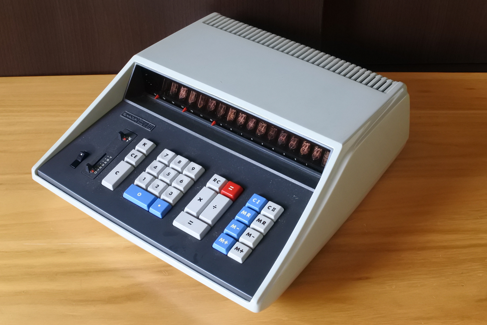
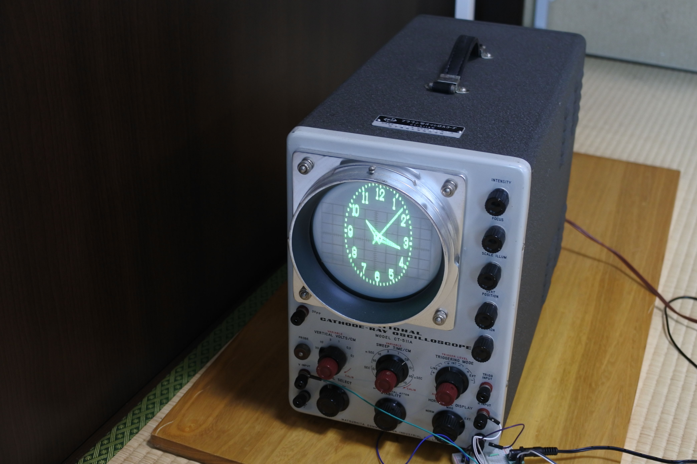

# donation-item-list

過去に収集したいろいろな物品のいくつかを[科学技術継承財団(夢の図書館+マイコン博物館+模型とラジオの博物館)](https://scitech.or.jp/)に寄贈させていただくことにしました。
それらに関する情報を整理するために作ったページです。

寄贈した個体について以下のような順でまとめてあります．
### 機種名
- 寄贈した個体個別の情報(動作の可否等．)
- 個体の写真
- この機種に関する一般的情報．([電卓博物館](http://www.dentaku-museum.com/)からの引用が多いです．)
- 動画(あれば)

## 寄贈品リスト(2025年)
### CASIO AL-1000
- 一部動作OK．(計算OK．プログラムNG?)

- 1967年10月発売．当時の価格 328,000円．
- プログラムをソフトウェア化し、一連の命令をキーボードで簡単に記憶装置に入力できるようにした世界で最初のプログラム付電卓。
14桁の演算レジスター・記憶レジスター(4組）・プログラム記憶装置（30ステップ、15ステップ2組に分割可能）を全て磁気コアで形勢させたので、普通の電卓と同程度の小型化が実現した。
価格も普通の電卓と比べ3割程度しか高くなかったので、国内はもとより欧米各国でも非常な人気を博し、ベストセラー電卓となった。
([電卓博物館](http://www.dentaku-museum.com/calc/calc/2-casio/1-casiod/casiod.html)より引用)
#### 動画

### CASIO AL-2000
- 動作NG．
- この個体は京大工学部工業化学教室で使用されていたもののようである．

- 1969年発売．当時の価格318,000円．

#### 動画

### CASIO model 122
- 動作NG．

- 1970年9月発売のCL-100の姉妹機．137,000円

### SONY SOBAX 510 (ICC-510)
- 動作OK．

- 1969年発売．当時の価格228,000円．
- 1967年6月に発売されたソニー最初の電卓ICC-500(価格260,000円)の後継機．

### SONY SOBAX 330 (ICC-330)
- 動作OK．ソニーのロゴと銘板が欠落．

- 1973年発売．
- 同シリーズのICC-300(価格69,800円)に事務処理の機能を強化したもの．
- このシリーズは、機種により機能の違いはあるものの、下記のような共通の特徴を持っていた。
([電卓博物館](http://www.dentaku-museum.com/calc/calc/4-sony/sobax/sobax.html)より引用)
  - 小型、高性能、高信頼性
  - 理想的な小数点方式
  - 計算式どおりの操作、不要なゼロの消去、自動クリヤー方式
  - 見やすい”ニュープラニトロン”
  - 豊富な演算機能
  - 高級タイプライターのフィーリングを持つキースイッチ

### Canon Canola 164P
- 動作OK?．ニコイチで一応動くようにしたもの．

- 1969年発売(?)
- カード式プログラム電卓
- 下記リンクに情報あり．
  - [https://www.oldcalculatormuseum.com/canon164p.html](https://www.oldcalculatormuseum.com/canon164p.html)

### Sharp Compet 23 (CS-23A)
- 動作OK．(加算と乗除算はOK，減算がNG．マイナスキー反応せず?)

- ネット上に情報無し．かなり希少かも．
- ニキシー管点灯まで十秒程度かかる．

### Sharp Compet 363P (CS-363P)
- 動作NG．電源入らず．キー固着．

- 1971年発売．320,000円
- 1971年に発売された高級プログラム電卓。7メモリー、144ステップ、磁気カード方式を採用。サブ・ルーチン機能、データの外部記憶機能をこのクラスで初めて搭載ミニコン並の能力を持つことに成功した。使用素子　ELSI 6個　その他LSIなど。340(W)×420(D)×143(H)mm。8.5kg。
([電卓博物館](http://www.dentaku-museum.com/calc/calc/1-sharp/1-sharpd/sharpd.html)より引用)
- 下記リンクに情報あり．
  - [https://www.oldcalculatormuseum.com/sharp363p.html](https://www.oldcalculatormuseum.com/sharp363p.html)

### Sharp Compet 363R (CS-363R)
- 動作OK．キーの固着があるので，要メンテ．

- 型番の"R"は平方根を表す．√キーは無く，÷＝で平方根を計算する．
- 下記リンクに情報あり
  - [https://www.johnwolff.id.au/calculators/Facit/1135/Facit1135.htm](https://www.johnwolff.id.au/calculators/Facit/1135/Facit1135.htm)

#### 動画

### Sharp Compet 362 (CS-362)
- 動作NG．入手した当初は動いたが，電源が入らなくなってしまった．M+IIのキーが固着して動かない．(修理を試みたが無理だった．)

- 当時の価格 220,000円
- 事務用万能機．16桁．

### Hitachi ELCA 22 (KK-22)
- 動作OK．(四則演算，メモリを確認)

- 1968年7月発売．当時の価格239,000円．寸法　幅28cm×奥行36cm×高さ12.4cm．
- ELCA22 は、1968年７月に発売されたMOS-IC電卓。106個のMOS型トランジスタ、MOS型ダイオードを搭載している。機能としては、ELCA12の機能に個々の積および積和（差）、オーバーフロー機能、メモリー機能が追加された。MOS-ICを搭載することでELCA12と比べ総部品数では1/5、容積1/4、重量1/3になった。([電卓博物館](http://www.dentaku-museum.com/calc/calc/6-hitachi/hitachid/hitachid.html)より引用)
- 電源を入れてニキシー管が全点灯するまで1〜2分ほどかかる．

### Hitachi ELCA 42 (KK-42)
- 動作OK．(四則演算，メモリを確認)

- 1971年4月発売．125,000円．
- 純国産LSI使用したわが国最初の卓上計算機．計算素子は HI・LSI。他にレジスター3個、メモリー1個使用。26.5(W)×30.8(D)×10.0(H)cm。
- [電卓博物館](http://www.dentaku-museum.com/calc/calc/6-hitachi/hitachid/hitachid.html)に取扱説明書あり．

### Ricoh RICOMAC 1420
- 未使用品(?)．説明書付き．

- 1969年発売．当時の価格は278,000円．28(W)×42(D)×12(h)cm。7kg。
- MOS-ICの全面採用により小型化を実現した。メモリーは2個。

### Ricoh RICOMAC 121N
- 動作OK．(四則演算，メモリを確認)

- 1970年後半から71年前半にかけて発売されたものと推定される。([電卓博物館](http://www.dentaku-museum.com/calc/calc/12-ricoh/ricohd/ricohd.html)より)

### Toshiba BC-1002
- 動作OK．

- 1971年発売．95,000円．182(W)×257(D)×88(H)mm。1.9kg。
- 10桁シリーズの卓上計算機。演算素子としては東芝が電卓用に独自に開発したLSIを3個使用し、安定した性能とコンパクト化を実現した。
BC-1002は、手や指の大きさに合わせたB5版「ジャストサイズ」で、表示は10桁だが14桁まで計算ができ、価格は95,000円と当時の携帯型と比べ少し高いだけであった。表示部分にフードを付け、表示部をみやすくするとともに、開閉と同時に電源がオンオフするようになっていた。
([電卓博物館](http://www.dentaku-museum.com/calc/calc/5-toshiba/1-toshibad/toshibad.html)より引用)
 
### Toshiba BC-1011
- 動作OK．

- 1971年5月発売．115,000円。182(W)×88(H)×257(D)mm。重量 1.9kg.
- BC-1002 に1メモリを追加したもの。東芝が初めて電卓用として量産化に成功した「汎用LSI」を使用している。特徴として、表示桁数は10桁だが、演算結果が10桁を超えた時はキー操作で表示数を右へ1桁ずつシフトすることで最大14桁まで演算できる。また、「AA」キーをロックすることで累計計算ができる．
([電卓博物館](http://www.dentaku-museum.com/calc/calc/5-toshiba/1-toshibad/toshibad.html)より)

### Unitrex IC-8
- 動作NG．

- 1968年11月発売．価格は158,000円だった。21×29×9.9cm。 2.9kg。
- 栄光ビジネスマシンより発売されたユニトレックスIC8。
桁数は8桁と少ないがICを使うことにより小型で軽量化されていた。
([電卓博物館](http://www.dentaku-museum.com/calc/calc/15-eiko/unitrexd/unitrexd\
.html)より引用)
- [Calcuseum](http://www.calcuseum.com/scrapbook/BONUS/15048/1.htm)のCollector valueが9/10なのでかなりレアだと思われる．

### Unitrex Frontier K-305
- 動作NG．(表示は点灯するが挙動がおかしい．)

- 上記IC8のOEMっぽい．ネットに情報無し．

### タイガー計算器 Tiger 特装型18号(3期?)
- 動作OK．一応動くが若干固いので要メンテ．

- 1950年代
- [電卓博物館](http://www.dentaku-museum.com/hc/computer/mechanical/mechanical.html)

### タイガー計算器 Tiger E64-21
- 動作NG．

- 電動機械式．
- 1964年発売．当時の価格1,470,000円(?)

### FACIT CA1-13
- たぶん動作NG．要220Vのため未確認．

- 電動機械式．
- 1969年頃発売?

### National CT-511A
- オシロ時計表示OK．詳細動作は未確認．

- 22(W)×42(D)×32(H)cm．約15kg

### Tektronix 454A
- オシロ時計表示OK．詳細動作は未確認．

- 1971〜1974年
- 帯域幅 150MHz．
- 独自のハイブリッド回路や集積回路を使用していない．
- [https://w140.com/tekwiki/wiki/454](https://w140.com/tekwiki/wiki/454)

### Tektronix 468
- オシロ時計表示OK．詳細動作は未確認．

- 1980〜1985年．
- 帯域幅 アナログ100MHz, デジタル10MHz，シングルショット2.5MHz．
- [https://w140.com/tekwiki/wiki/468](https://w140.com/tekwiki/wiki/468)

## 寄贈品リスト(2022年)
### Toshiba BC-1001
- 動作OK．

- 東芝の最初の電卓．
- 表示は光点表示器。アクリル板にドットで数字が描かれていて、横から光を入れて照らすと数字が表示される仕組み。下記リンク先に詳しい情報あり。
  - [http://www.electricstuff.co.uk/count.html](http://www.electricstuff.co.uk/count.html)
  - [http://www.dentaku-museum.com/1-exb/special/displaybyty/display.htm](http://www.dentaku-museum.com/1-exb/special/displaybyty/display.htm)
- 1965年12月に東芝が初めて発売した電卓（京浜、京阪神地区、全国発売は1966年4月から）。自社で開発した高性能トランジスタを使って完成させた。
([電卓博物館](http://www.dentaku-museum.com/calc/calc/5-toshiba/1-toshibad/toshibad.html)より引用)
  - テンキー式10桁。
  - 239(H)×403(W)×458(D)mm。重量　約18kg。
  - 定価　　　　 375,000円。現金定価　　360,000円。あやまって破損しても保障する動産総合保険が付いていた。

#### 動画

### Toshiba BC-1201
- 動作OK．

- 1967年5月に発売された東芝初期の12桁オールトランジスタ製デスクトップ電卓。自社製の高性能トランジスタ、ダイオードを使用した当時としては世界トップレベルの小型機。
([電卓博物館](http://www.dentaku-museum.com/calc/calc/5-toshiba/1-toshibad/toshibad.html)より引用)
- 332(W)×419(D)×202(H)mm。
- 当時の定価（現金定価）　219,000円。

#### 動画

### Toshiba BC-1411
- 動作NG．

- 1966年12月発売．価格は390,000円（月賦定価 420,000円）．
- 東芝２代目の電卓。14桁1メモリ。技術的にはメモリー部分に初めてコンデンサー・メモリーを採用することで部品点数の削減、小型化を実現した。外観はキーボード部分にディスプレイ部分が載った形をしているが、内部は８枚のキーボードが垂直に並んでいる。スマートに見せるための工夫で、初期の電卓の中ではデザインが秀逸。([電卓博物館](http://www.dentaku-museum.com/calc/calc/5-toshiba/1-toshibad/toshibad.html)より引用)

### Sharp PC-7200
- 一部動作OK．(下8桁点灯せず．)

- 1977～78年頃の高校の教育用計算機
- CPUはRockwell PPS-8
#### 動画

